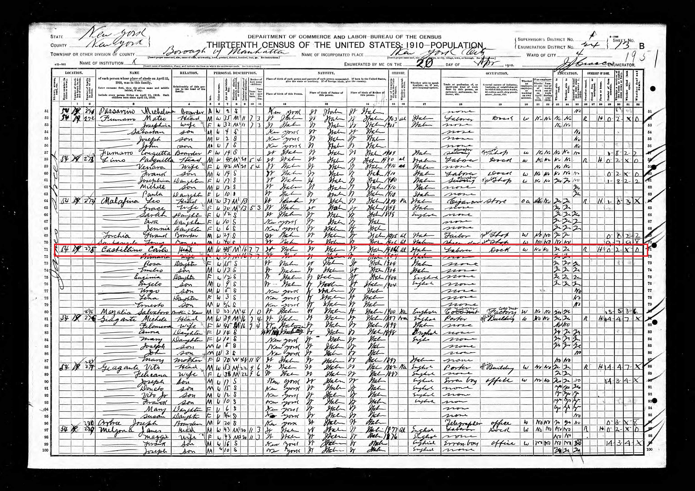
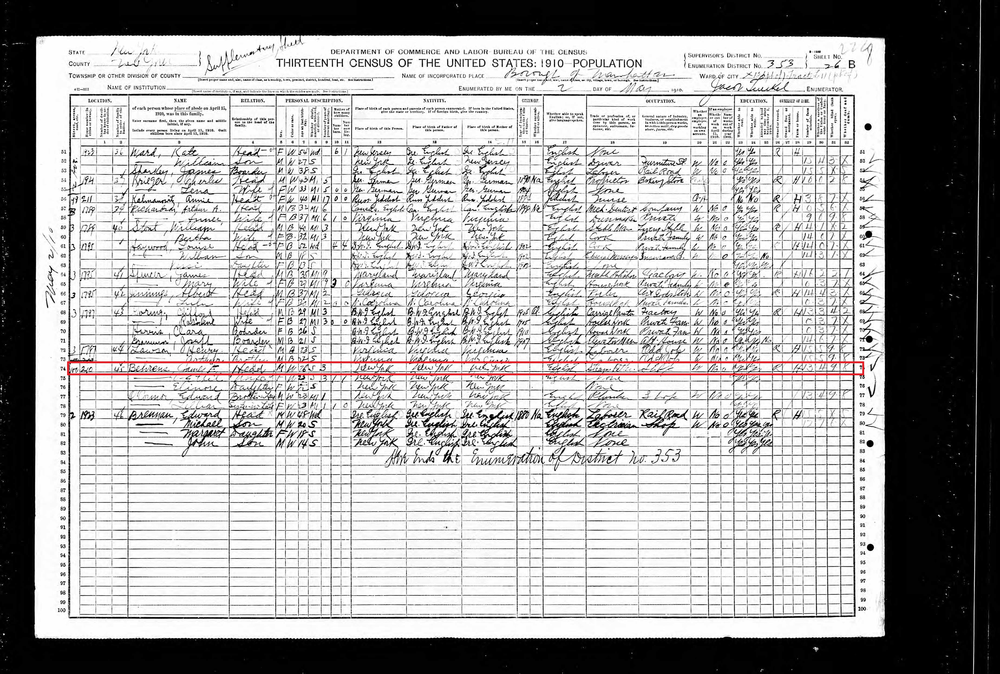
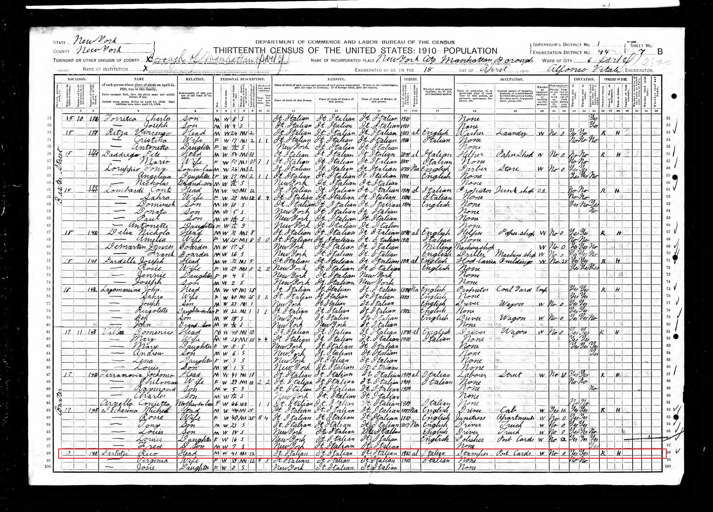

```{r setup, include=FALSE}
library(tidyverse)
library(knitr)
library(kableExtra)
```

# 1. Load Data
```{r, message = FALSE}
sample_raw <- read_csv("data/us1910m_usa_sample100k.csv")
edict <- read_csv("data/full_mn_dict.csv")

sample_raw <- street_match(sample_raw, edict)
sample <- fillDownStreet(sample_raw)
```

# 2. Separate House Numbers
Note: code is the same as Bo's `in_progress_HN_html` script, look at that script for more documentation

Preprocessing to filter records with address numbers - note, not filtered by "H" records as this presents difficults downstream with look around (too many NAs).
```{r}
HN <- sample %>%
    fill(microfilm, .direction = "up") %>%
    filter(!is.na(house_num)) %>%
    select(microfilm, ED, 
           dwelling_ser, house_num, street_add, best_match) %>%
    mutate(originalHN = house_num,
           house_num = ifelse(house_num=="", NA, as.character(house_num)),
           street_add = ifelse(is.na(street_add), " ", street_add))
```

Extract house number
```{r}
HN <- HN %>% rowwise() %>%
  mutate(flag1=ifelse(is.na(house_num)&
                               !is.na(str_extract(street_add,"[0-9]+\\s*(-|TO)+\\s*[0-9]+")), 
                             str_extract(street_add,"[0-9]+\\s*(-|TO)+\\s*[0-9]+"),
                             NA),
         house_num=ifelse(is.na(house_num), flag1, house_num),
         flg_hn_from_strt2=ifelse((!is.na(flag1))&(house_num != flag1) , 1, 0),
         flg_hn_from_strt=ifelse(is.na(flag1), 0, 1),
         house_num = gsub("\\s*(TO)\\s*", "-", house_num, ignore.case = TRUE)) %>%
  select(-flag1)
```

Cleaning
The chunk below does:

1. Copy `1/2` or `1-2` from `house_num` to `modifier.number` column
2. Remove `1/2` or `1-2` from `house_num`
3. Change `TO` and `/` into `-`
4. Copy any modifier words from `house_num` to `modifier.number` column
5. Remove excess whitespaces
6. Remove any modifier words from `house_num`

** I include `1-2` just in case this exists. The regex for this case excludes `11-20` for example.
```{r}
HN <- HN %>% rowwise() %>%
  mutate(modifier.number = str_extract(house_num, "\\s1[/-]2\\b"), 
         house_num = gsub("\\s1[/-]2\\b", " ", house_num),  
         house_num = gsub("\\s*(TO|/|&)\\s*", "-", house_num, ignore.case = TRUE), 
         house_num = gsub("(?<=\\d)\\s+(?=\\d)", "-", house_num, ignore.case = TRUE, perl = TRUE), 
         modifier.word = trimws(str_extract(house_num, "[A-Za-z\\s]+")),            
         house_num = gsub("\\s+", " ", house_num),                    
         house_num = trimws(gsub("[A-Za-z\\s]+", "", house_num)),
         house_num = gsub("^\\D+", "", house_num, ignore.case = TRUE), 
         house_num = gsub("\\D+$", "", house_num, ignore.case = TRUE), 
         flg_cleaned = ifelse(originalHN=="", 0, ifelse(house_num==originalHN, 0, 1))) 
```

Splitting house ranges with "-"
First, a look at such house numbers:
```{r}
HN %>%
  filter(str_detect(house_num, "-")) %>%
  select(ED, best_match, house_num) %>%
  distinct() %>%
  kable() %>% kable_styling() %>% scroll_box(height = "300px")
```

One notable problem is that some number ranges are incomplete, e.g. 177-72. To fix house number ranges, we will use a code that splits house numbers by "-", and appends the leading _n_ numbers to the front for house numbers that are of different length post-split. This is subject to the constraint that the resulting number will have the same length.

An example of how this works on actual numbers observed above:

14-16 > split > 14-16 > detect length > 2, 2 > No further action!
177-72 > split > 177, 72 > detect length > 3, 2 > append front 1 (3 - 2) chr > 177, 172
1775-3-10 > split > 1775, 3, 10 > detect length > 4, 1, 12 >
  for 3: append front 3 (4 - 1) chr > 1773
  for 10: no appending because if append resulting string = 17710 > 10

```{r}
hn_range_clean <- function(hn_range) {
  hn <- hn_range %>%
    str_split("-") %>% unlist()
  
  same_length <- str_length(hn) %>%
    unique() %>%
    length() == 1
  
  if (!same_length) {
    hn <- as.integer(hn)
    max_hn <- as.character(max(hn))
    min_hn <- as.character(min(hn))
    len_diff <- str_length(max_hn) - str_length(min_hn)
    
    clean <- map_chr(hn, function(x) ifelse(str_length(x) < str_length(max_hn), 
                                            ifelse(str_length(paste0(str_sub(max_hn, 1, len_diff), x)) == str_length(max_hn),
                                                   paste0(str_sub(max_hn, 1, len_diff), x),
                                                   x),
                                            x)
                     )
    
    hn_range <- str_c(clean, collapse = "-")
    
  }
  
  return(hn_range)
}
```

Before and after cleaning for cleaned house num ranges:
```{r}
HN %>%
  filter(str_detect(house_num, "-")) %>%
  mutate(hn_cleaned = hn_range_clean(house_num)) %>%
  filter(house_num != hn_cleaned) %>%
  select(ED, best_match, house_num, hn_cleaned) %>%
  distinct() %>%
  kable() %>% kable_styling() %>% 
  row_spec(19, background = "#ff8080") %>% scroll_box(height = "300px")
```

The 19th row is highlighted as the output of clean is still wrong. It is currently not addressed as the I am not sure what the house number should actually be. 

Code to actually create the separated house numbers:
```{r}
HN <- HN %>%
  mutate(hn_range = hn_range_clean(house_num)) %>%
  mutate(flg_cleaned = ifelse(house_num == hn_range, 0, 1)) 

splt_df <- str_split_fixed(HN$hn_range, pattern = "-", n = 3) %>% data.frame() %>% 
  rename(hn_1 = X1, hn_2 = X2, hn_3 = X3) %>% 
  mutate_all(as.character) %>% mutate_all(as.numeric)

HN <- HN  %>% cbind(splt_df)
```

# 3. Fill Down
Basic Principle: if the first non-NA above and first non-NA below has a difference of 0 or 2, AND the ED of those are the same, AND the street address are the same, fill down.

```{r, eval = FALSE}
approach_1 <- HN %>%
  
  # fix street_add
  mutate(street_add = as.character(street_add)) %>%
  
  # create copy of the columns to filled up/down - these should only be filled for records with house no.s
  mutate(above_hn = hn_1, below_hn = hn_1) %>% 
  mutate(above_ED = ifelse(!is.na(hn_1), ED, NA), below_ED = ifelse(!is.na(hn_1), ED, NA)) %>%
  mutate(above_add = ifelse(!is.na(hn_1), street_add, NA), 
         below_add = ifelse(!is.na(hn_1), street_add, NA)) %>%
  
  # fill
  fill(above_hn, .direction = "down") %>%
  fill(below_hn, .direction = "up") %>%
  fill(above_ED, .direction = "down") %>%
  fill(below_ED, .direction = "up") %>%
  fill(above_add, .direction = "down") %>%
  fill(below_add, .direction = "up") %>%
  
  # can we confidently fill up/down?
  mutate(yes_fill = ifelse(abs(above_hn - below_hn) %in% c(0, 2)
                           & above_ED == below_ED & above_ED == ED
                           & above_add == below_add & above_add == street_add
                           & is.na(hn_2), 
                           1, 0))

# how many confident fill downs?
sum(approach_1$yes_fill)
sum(approach_1$yes_fill) - sum(!is.na(approach_1$hn_1))
```

Using this method, 5806 additional records have been recovered (with confidence), i.e. we have 10660 confident house numbers. This number is likely to increase with cleaned street addresses.

Code to actually do the fill down (above is just EDA). Chunk set to `eval = FALSE` for now. Run this code instead of chunk above.
```{r, eval = FALSE}
HN2 <- HN %>%
  
  # create copy of the columns to filled up/down - these should only be filled for records with house no.s
  mutate(above_hn = hn_1, below_hn = hn_1) %>% 
  mutate(above_ED = ifelse(!is.na(hn_1), ED, NA), below_ED = ifelse(!is.na(hn_1), ED, NA)) %>%
  mutate(above_add = ifelse(!is.na(hn_1), best_match, NA), 
         below_add = ifelse(!is.na(hn_1), best_match, NA)) %>%
  
  # fill
  fill(above_hn, .direction = "down") %>%
  fill(below_hn, .direction = "up") %>%
  fill(above_ED, .direction = "down") %>%
  fill(below_ED, .direction = "up") %>%
  fill(above_add, .direction = "down") %>%
  fill(below_add, .direction = "up") %>%
  
  # replace hn_1 column
  mutate(hn_1 = ifelse(abs(above_hn - below_hn) %in% c(0, 2) 
                       & above_ED == below_ED & above_ED == ED
                       & above_add == below_add & above_add == best_match
                       & is.na(hn_2), 
                       above_hn, hn_1)) %>%
  
  # clean
  select(- c(above_hn, below_hn, above_ED, below_ED, above_add, below_add))
```

# 4. Out of Range House Numbers EDA
We use the street dictionary with house numbers (`hn_dict`) to verify which house numbers are completely not within the range indicated by the street dictionary.

Import and wrangle `hn_dict` to be appropriate for our use.
```{r, message = FALSE, warning = FALSE}
hn_dict <- read_csv("data/combine_mn.csv") 

# some of the highs are lower than low; define function below to fix this
fix_order <- function(str) {
  if (str == "NA?NA") {return (NA_character_)}
  
  str_split(str, "\\?") %>% 
    unlist() %>% 
    as.integer() %>%
    sort() %>% 
    str_c(collapse = "?")
}

hn_dict <- hn_dict %>%
  mutate(ED = str_pad(ED, 4, "left", pad = "0")) %>%
  select(ED, Name, Left_Low, Left_High, Right_Low, Right_High) %>%
  unite(col = "Left", Left_Low, Left_High, sep = "?") %>% 
  unite(col = "Right", Right_Low, Right_High, sep = "?") %>%
  rowwise() %>%
  mutate(Left = fix_order(Left), Right = fix_order(Right)) %>%
  ungroup() %>%
  gather(key = "column", value = "value", -c(ED, Name)) %>% 
  separate(col = value, into = c("Low", "High"), sep = "\\?") %>%
  mutate(Low = as.integer(Low), High = as.integer(High))
```

EDA of house numbers beyond range dictated by `hn_dict`
```{r}
large_HN <- HN %>%
  left_join(hn_dict, by = c("ED" = "ED", "best_match" = "Name")) 
```

```{r}
large_HN %>%
  ungroup() %>%
  mutate(within = ifelse(hn_1 < Low | hn_1 > High, FALSE, TRUE)) %>%
  mutate(range = paste0(Low, "-", High)) %>%
  group_by(ED, best_match, hn_1) %>%
  summarize(n_out = sum(within), indicative_range = first(range)) %>%
  filter(n_out == 0) %>%
  select(- n_out) %>%
  kable() %>% kable_styling() %>% scroll_box(height = "300px")
```

There are 139 records out of the bounds of the house number range.

Tailor the code to specifically look for large house numbers. The conditions for this:  
- Length of house number is larger than 4  
- Length of house number is not the same as low and high house number range from `hn_dict` (as large numbers may exist for certain streets)  
- However, the separated house number would be within the house number range from `hn_dict`
```{r}
large_HN %>%
  filter(str_length(hn_1) >= 4) %>%
  filter(str_length(hn_1) != str_length(Low) & str_length(hn_1) != str_length(High)) %>%
  mutate(hn1_first_2 = as.integer(str_sub(hn_1, 1, 2))) %>%
  mutate(hn1_last_2 = as.integer(str_sub(hn_1, str_length(hn_1) - 1, str_length(hn_1)))) %>%
  filter(hn1_first_2 >= Low & hn1_first_2 <= High & hn1_last_2 >= Low & hn1_last_2 <= High) %>%
  select(house_num, hn_1, hn_2, hn_3, Low, High) %>%
  kable() %>% kable_styling()
```

Code to actually split the house num:
```{r}
large_HN <- large_HN %>%
  mutate(hn1_first_2 = as.integer(str_sub(house_num, 1, 2)),
         hn1_last_2 = as.integer(str_sub(house_num, str_length(house_num) - 1, str_length(house_num)))) %>%
  mutate(hn_1 = ifelse(str_length(house_num) != str_length(Low) 
                & str_length(house_num) != str_length(High)
                & hn1_first_2 >= Low & hn1_first_2 <= High
                & hn1_last_2 >= Low & hn1_last_2 <= High,
                hn1_first_2, hn_1),
         hn_2 = ifelse(str_length(house_num) != str_length(Low) 
                & str_length(house_num) != str_length(High)
                & hn1_first_2 >= Low & hn1_first_2 <= High
                & hn1_last_2 >= Low & hn1_last_2 <= High,
                hn1_last_2, hn_2)) %>%
  mutate(hn_1 = ifelse(is.na(hn_1), house_num, hn_1))
```


```{r, eval = FALSE, echo = FALSE}
# archived code used to match numbers without use of `hn_dict`. not necessary anymore except for reference.

large_hn <- HN %>%
  mutate(hn1_first_2 = as.integer(str_sub(hn_1, 1, 2))) %>%
  mutate(hn1_last_2 = as.integer(str_sub(hn_1, str_length(hn_1) - 1, str_length(hn_1))))

large_hn$next_hn <- large_hn$hn_1 %>% unlist() %>%
  append(NA_integer_, after = length(.)) %>%
  .[-1]
  
large_hn$prev_hn <- large_hn$hn_1 %>% unlist() %>%
  append(NA_integer_, after = 0) %>%
  .[-length(.)]

large_hn$prev_street_add <- large_hn$street_add %>% unlist() %>%
  append(NA_character_, after = 0) %>%
  .[-length(.)]

large_hn$next_street_add <- large_hn$street_add %>% unlist() %>%
  append(NA_character_, after = length(.)) %>%
  .[-1]

large_hn %>%
  filter(str_length(hn_1) != str_length(next_hn) 
         & str_length(hn_1) != str_length(prev_hn)
         & street_add == prev_street_add
         & street_add == next_street_add) %>%
  select(ED, house_num, hn_1, hn1_first_2, hn1_last_2, prev_hn, next_hn) %>%
  kable() %>% kable_styling() %>%
  scroll_box(height = "300px")

# specific to large house numbers
large_hn %>%
  filter(abs(hn1_first_2 - hn1_last_2) < 10) %>%
  filter(str_length(hn_1) >= 4) %>%
  select(ED, house_num, hn_1, hn1_first_2, hn1_last_2, prev_hn, next_hn) %>%
  kable() %>% kable_styling()
```

# 5. EDA on sources of potential error
The original census manuscripts were then referred to in order to understand what the mistakes are.

## Example 1: Mistranscribed

Here, 54 was clearly written in the manuscript but somehow mistranscribed into 554.

## Example 2: House Number Range
9092 was clearly a house number range, especially since it's in between 86 and 94.

## Example 3: Non-sequential Visits


Here, the odd house numbers was due to the census taker going back to houses that he failed to  visit (e.g. if no one was home), hence the sequence of numbers is very random.

## Note: Other errors found by accident


Here, 17 was written but mistranscribed into 0.

# 6. Next Steps
1. Some 'large' house numbers are improperly cleaned house ranges. For example, 177-72 probably means 177-172, but the code would instead separate the range into 177-72.

2. Further EDA on errors detected by house number ranges, nothing that these may instead reflect bad matches derived from the address cleaning process.

3. To incorporate various errors into code. Some ideas for known errors (found in Section 5):
a. To account for mistranscriptions: Check similarity of one number to another using string distance calculations/creating own algorithm that calculates distance based on ACSII codes.
b. To account for non-sequential but correct house numbers: To check if there is a pattern. We know that these tend to occurs towards the last few pages of each book. Is there page number data in our sample? If so, we can create exception in code for large numbers that occur in the last few pages.


